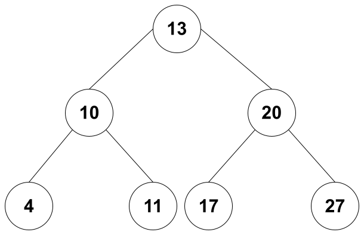
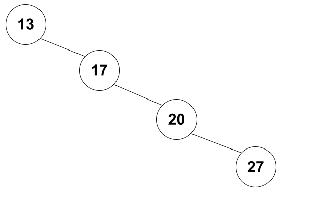
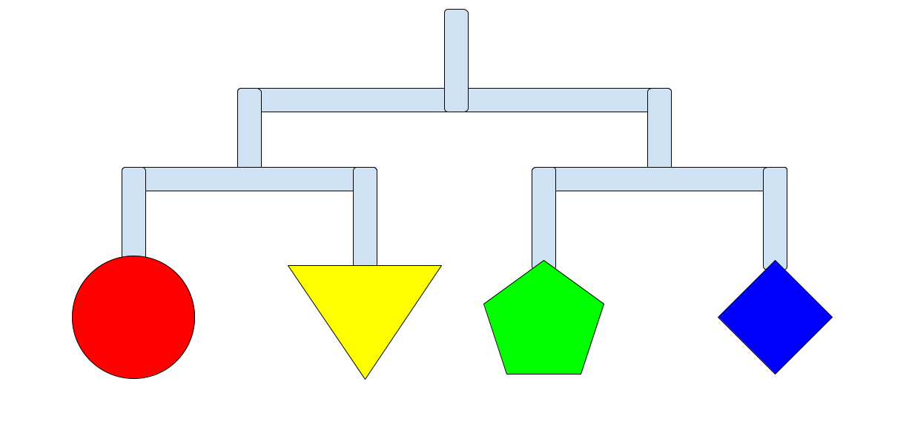

# Binary Search Tree

A binary search tree is a high-level data structure, and it would help to understand what linked lists and recursion are before continuing. If this is the first you’ve heard of these, I would suggest finding tutorials for them before beginning this module.

## Technical Description

Before we get into what a binary search tree is, we're going to take a very quick detour through linked lists. A linked list is a data structure made up of many different nodes. These nodes have data in them, as well as pointers with the address of the node just before them, and the node after them. Trees, and by extension binary search trees, use the same operating principle. Trees are made up of nodes, and the nodes contain data and pointers to its parent node and its child nodes. If you put these all together, you'll get a structure looking something like this:

Notice how each node only has two child nodes, that means that this is a binary search tree. 

Trees are organized with nodes that are greater than the parent node on the right, and lower than the parent on the left. However, we also need to take into account the balance of the tree. A tree is considered to be balanced if the "branches" are all about the same height. This tree is balanced:

And this tree is not:

The reason it's so important to have a balanced tree is because a balanced tree will increase your efficiency. The tree on the top has a efficiency of O(log n) when trying to find a number in the nodes, while the other tree has an efficiency of O(n), and when everything gets big enough, this efficiency change is incredibly important! I will not go over how to balance trees in this tutorial, but if you're interested, I would look up AVL (Adelson-Velskii and Landis) trees.

## Metaphor

Imagine instead of a tree, we have a baby mobile, somthing that looks like this:

Each joint is a new node with data on the tree. If we have an equal number of nodes on each side then the mobile will stay balanced and out of the babies reach. However, if we move all the modes to the right side, then the mobile will become unbalance and the shapes will all fall in reach of the baby.

## Useful For?

## How to Use and Code walkthrough

Once you feel comfortable with the code try doing [this](tree_problem.py) problem on your own.

Finally, once you've finished, you can look at [this](tree_solution.py) possible solution and compare it to yours.